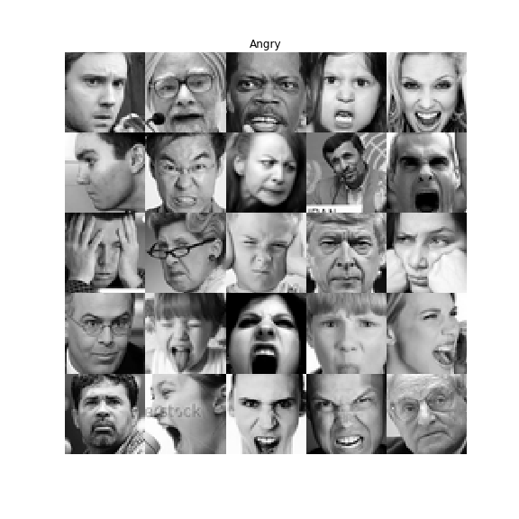
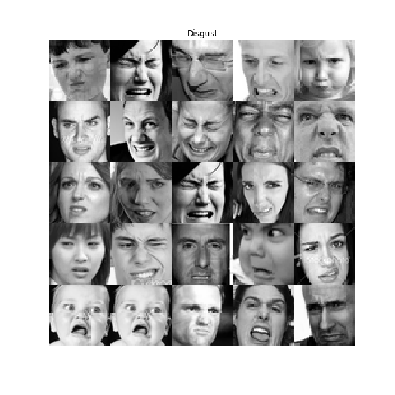
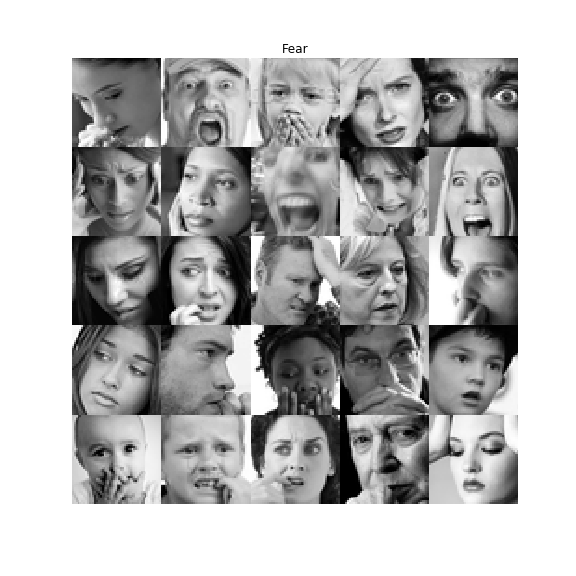
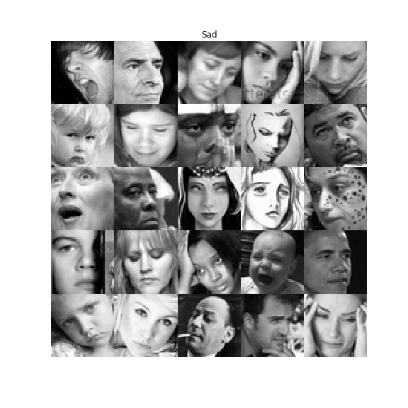
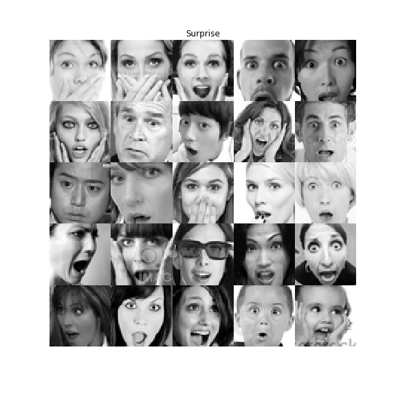

# FACE_EMOTION_DATASET

This is the code for preprocesing the facial emotion data set, which originally obtained from [Kraggle](https://www.kaggle.com/c/challenges-in-representation-learning-facial-expression-recognition-challenge)(hence I claim no authorization on this dataset). Due to the cost of loading the file and its non-trainable property in terms of balance in number of classes and random distribution, I write this code to preprocess as well as provide methods to load the files faster. This newly gained advantage has to pay off with a big growth of data size, originates from characteristic of pickle, the form I used to store the final data set.

## FOLDER CONTENT
- Folders marked from **0** to **6**, are representing for the set of **Angry**, **Disgust, Fear, Happy, Sad, Surprise, Neutral** images, respectivly. The good news is all data are in image form, which easily to process. Unfortunately, a quick look at number of data shows a huge bias between **Happy** and **Disgust** (**8988** vs **547** samples). Furthermore, the data is not clean with several full-black images.
- **preprocess_data.py**: I could not simply upload the final data and its load functions due to limitation of file size of GitHub, and hence the alternative way is re-run the code and generate your own version.
- **load_data.py**: contain simple code to load the dataset for further use.
- **instruction.ipynb**: instructive code utilizing wonderful reporting features of notebook to give you a more detailed of how I have done it.

## DATA SET
The data set contains of total 7 kinds of facial expression, with corresponding number of samples:

| Emotion     |  Number of Samples | Deleted Black/White image |
| ----------- |:------------------:|:-------------------------:|
| Angry|4953|4945|
| Disgust|547|547|
| Fear|5121|5121|
| Happy|8989|8988|
| Sad|6077|6076|
| Surprise|4022|4001|
| Neutral|6198|6197|

![Happy]](img/Happy.png)

## A BRIEF SKETCH OF PREPROCESSING SCHEME
You can find a more detailed report in **instruction.ipynb**. Here, I would give merely the core idea:
- In order to create balance in each class/label, my solution is setting the number of taken images equal to the class has smallest number of sample, or second smallest (which is synonym to get rid of **Disgust** class from the final dataset).
- Second, approximately 30 images are purely black or white. I run a heuristic to erase these rare cases by checking whether all the pixels sharing a same value. If yes, we will skip it, otherwise, count it as a valid sample.
- One condition held, the others is random distribution of the classes in both training and test set. I simply achieved it by first make sure number of samples of each class are the same, then a random permutation will solve the rest. I make sure that the training and test set are not overlapped to each other, yet no guaranteering that no existence of duplication in the dataset itself.
- The final dataset would be saved and loaded as a dictionary with keys as follows: train_dataset, train_labels,test_dataset, test_labels.

## HOW TO RUN
- Downloads all files in this repository. Extract the zip files.
- Choose generating small or big data set by modifying value of **IS_INCLUDED_DISGUST** in **preprocess_data.py**, then simply run it.
- For how to load the dataset, check **load_data.py**.

## ACKNOWLEDGEMENT
Thank you Kuba for converting the dataset from .csv format into images, which saved me an amount of time.

## CONTACT
Any problem arisen, please feel free to contact me( hovinh39@gmail.com ).